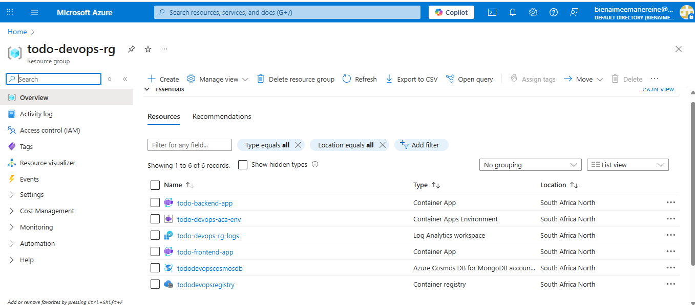
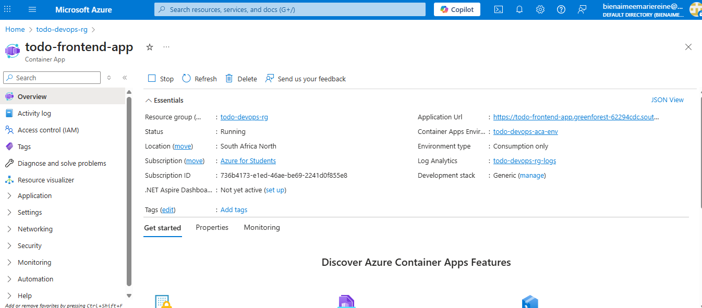
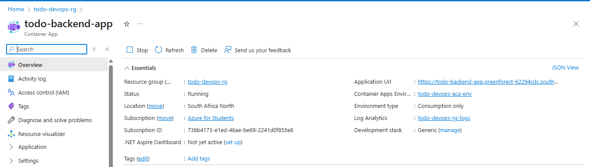

# Phase 2: IaC, Containerization & Manual Deployment Submission

## Live Public URL

https://todo-frontend-app.greenforest-62294cdc.southafricanorth.azurecontainerapps.io/

## Screenshots of Successfully Provisioned Resources

Here are screenshots of my deployed Azure resources:

## A link to the Pull Request you reviewed for your peer

[Link to peer PR here]

## A brief reflection on the challenges of IaC and the manual deployment process

(Your reflection text here)
